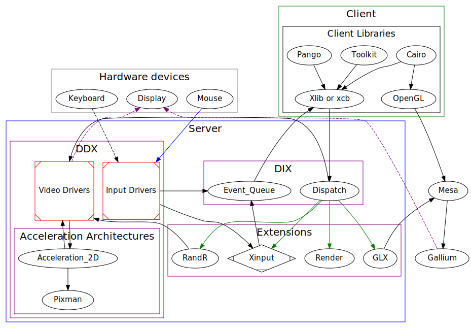

X窗口系统的概念
==============================
*Alan Coopersmith*

本章意在向你介绍X的基本概念和你所需要掌握的术语。当你理解这些概念后，你会在接下来的章节中更深入详细的条目。

#X Is Client／Server
X窗口系统设计来允许多个程序共同使用一个通用的硬件设置。这些硬件设备主要包括输入的鼠标和键盘，输出的显示适配器和连接它们的监视器。单线程控制硬件，多线程提供给应用程序接口。这个控制线程叫做X服务器，就像它提供给客户应用程序硬件服务一样。本质上，X服务器是一个给X用户使用键盘，鼠标和显示的接口。

像很多C／S系统一样，X服务器也代表性地向多个并发的客户端提供服务。X服务器运行的时间比绝大部分客户端要长，并且为新的客户端侦听入栈连接。

很多只在单机笔记本电脑或者桌面系统中使用X。在这种设置下，X客户端和X服务器运行在同一个电脑上。即使这样，X定义了一个为C／S的交流定义了一个流协议。这个协议能穿越网络来允许不同引擎的服务器和客户端通讯。不幸的是，这种模式下，客户端和服务器的标记可能会被误解。你也许正在使用运行X服务器的笔记本电脑，显示的图像生成于运行在拥有高性能引擎的远端引擎空间。对于大多数其他协议来说，笔记本电脑应该是文件分享，http，或者相似协议的服务的客户端。在以上情况，提醒你自己，键盘和鼠标连接着X服务器，这是很重要的。它也是所有客户端连接的终点(比如终端窗口，网页浏览器，文本编辑器)。

#X In Practice
这一节描述了一些X的基本块和他们具体如何工作。这一个所有东西都想在第一时间被呈现给读者的地方，所以这节内容会有些混杂。建议先略读，然后回头深入。

#Input
像稍早提到过的一样，X服务器底层控制两种硬件：输入设备和输出设备。令人惊奇的是，输入手段日趋困难并使输出也变得复杂。输入多源，并发，并且高度依赖复杂的用户参数。

##Input via Keyboard
X服务器实现的一个任务是接受键盘的输入并且向应用客户端发送正确的键入事件。在一个简单的X配置下，一个客户端在某个时间点有“输入焦点”并且大多数键入值都会应用于这个程序。依赖于窗口管理配置，单击鼠标、使用热键，或者操作一个显示活动客户端的面板会使焦点移动到别的窗口。有焦点的客户端以某种方式高亮，这样，用户就能知道他们输入的信息去向何处。客户端能够使用“grabs”（将在后面的章节中介绍）来更改默认的对焦点客户端的键事件交付。

世界上有很多种类的键盘类型。这源于不同国家,不同语言，不同硬件供应商产品特色的需求。这种差异使得键事件从硬件“key codes”到输入文本的映射成为一个富有挑战且复杂的过程。当键盘上的键被按下时X服务器提供一个仅仅8bit的键码来记录按键并发射事件。它也提供一个从这些键码到代表着象征标签的键“KeySyms”（如“A”，“Enter”，“Shift”）的键盘映射，键码在指定的场合外没有固定的意义，一个相同的按键也许会在不同的键盘，服务器，配置或者操作系统上形成不同的码值。KeySym值是全球统一的标准，并且大多数的应用都应该能与之交流。正在消失最初协议中的附加键处理功能一样，X Keyboard（XKB）扩展提供混合配置和模板处理。Xlib和工具包也提供更高级的输入功能的输入方法，比如组合按键处理或者映射键顺序到复杂语言（比如亚洲语言）。

##Input via Mouse
X协议定义了一个输入“指针”（和编程概念无关）。这个指针在屏幕上表现为光标，它通常被鼠标或者类似的输入设备所控制。应用能够控制这个光标的图像。核心协议包含一个简单两种颜色的光标的支持。着色补丁提供阿尔法32位混合色光标支持，这个支持一般从libXcursor中获得。

指针设备报告映射时间和按键并把事件发射到客户端。默认配置的Xorg服务器有一个单一的指针。这个指针集合映射和来自连接到服务器的指针类设备按键事件：比方笔记本电脑的触摸板和USB外接鼠标用户可以在Xinput扩展2.0中用MultiPointer X（MPX）功能实现多个光标并将设备分配给每个光标。使用MPX时，每个指针有自己的作用焦点。指针和键盘一一绑定来实现每个客户端的输入焦点和指针。

##Input via Touchpad
就基础输入而言，对于客户端来说触摸板只是另一种移动指针和发生点击事件的设备。想要超过仿真鼠标的客户端可以使用Xinput扩展2.2版（和Xorg 1.12封装在一起）或者其后开启多点触控支持的事件汇报。

##Input via Touchscreen
[XXX write me --po8]

##Advanced Input Devices and Techniques
[Make whot write this? or steal from http://who-t.blogspot.com? --alanc]

#GetImage: Reading From the Display
X服务器并不保留它已经在显示输出中绘制了图像的记录。一旦二进制数据被渲染交给帧缓存，X服务器的使命就结束了。如果数据需要被再次渲染（比如，它们只是被暂时隐藏了），X服务器会让一个客户端——一般要么是一个混合管理器，要么是原本就绘制这个数据的应用——来再次绘制它们。某些情况下，最有代表性的就是当你使用功能“screenshots（截图）”时，某个客户端需要直接重复帧缓存中的内容。为应对这种状况，X协议提供一个GetImage请求。GetImage有很多缺点，建议不必要时应该尽量避免使用。现代图像技术中，因为硬件和软件路径的渲染代价被优化来应对像素输出，GetImage成为了典型非常的慢的代表。GetImage也很难被正确地使用。在这里，不同于X中的所有地方，底层硬件直接暴露在客户端面前。帧缓存所包含的请求传递给客户端，同时完成帧缓存的校正，填充和字节定序。一般库代码可以在Xlib和XCB中用来将收到的帧缓存翻译成的有用信息。即使这样，用这个代码让进程更慢了。
    
#Output

##Rendering／ Rasterization
X独特地定义了一个由图元渲染功能架起的核心设定，比方划线，多边形填充和图像复制缓存。这些核心设定并不随被应用期望发展的现代图像技术的硬件和功能进化，并且现在主要引用于以前的应用。

现代应用使用多种客户端侧面渲染库，像Cairo来渲染2D图像或者OpenGL来渲染3D图像。它们也许把图像交给X服务器来显示，使用GPU加速的优点和别的硬件特性，或者使用DRI绕过X服务器直接和本地视频硬件进行交互。

###Polygon Rendering Model

##Displays and Screens
X把一个引擎的资源分配给显示和屏幕。显示通常是所有设备连接到一个X服务器，并且为单一用户显示一个单一的会话。系统也许会有多个显示，比如mulit-seat setups，甚至在系统控制台的多个虚拟终端。每个显示都有一套输入硬件配置和一个或者多个屏幕与之关联。屏幕是显示交叉的子集，窗口可以在显示交叉中移动或者显示，但是窗口不能跨越过多个屏幕或者从一个屏幕移动到另一个屏幕。输入设备可以在一个X Server的所有屏幕上进行交互，比如把鼠标从一个屏幕移动到另一个。最开始，每个屏幕都是只有单个监听器连接的单个独立的显示适配器，不过现代科技允许多个设备组合工作或者一个设备拆分工作。

当把一个客户端连接到X服务器上的时候，你必须要指定你要连接到的显示，要么通过$DISPLAY环境变量，要么通过应用的参数，比如-display或者--display。所有的语法都在man的X(7)页面中能够找到，但是典型的呈现语句是：hostname:display.screen。"hostname"在本地连接中也许会被忽略，而在使用默认屏幕时".screen"也会被忽略，剩下最小规格的display规范":display"，比如":0"在一个引擎上定义了普通默认的X Server。

##Graphics contexts
GC是一个为X绘制储存分享状态和公共值功能的结构，避免对相同参数作出复数回应。客户端可以按需分配附加的GC来实现通过为每个值的设置装配GC去指定不同的值然后只用为每个运算制定适当的GC。

##Colors (really?) and Visuals
X太老了，以至于它被设计出来时，大多数用户都还在使用黑白两色的可选的呈现，那时，硬件厂商甚至没有在黑0白1或者白0黑1上达成一致。花上额外一千美刀的人能拥有4或8bit的颜色，允许画板上有256种颜色。但现在已经是2012年了，大家电脑上都有32bit的颜色。不变的是，很多复杂的事依然存在而且某人必须解决它们。。。

##Syncing and Flushing connections
和描述通信章节一样，X也尽量通过异步来减少通信延时。这引起了使用渲染功能的码农们的注意，他们震惊于自己没有得到错误反馈但也没有看到期望的输出。那之后，绘制运算不用等待来自X Server的回应，它们仅仅寄存在客户端输出请求缓存里，并且，在缓冲被冲出之前都不会发送给X Server。在被充满后，缓存会自动被冲出，但是这要求很多命令来填满Xlib默认32kb的缓存空间。当一个为了等待来自X Server的响应的功能而阻塞时（虽然这些功能在Xlib和XCB这两种设计模式中是有区别的--详见Xlib和XCB章节），Xlib和XCB会冲出缓存。最终，客户端明确地调用Xlib中的XFlush()或者XCB中的xcbflush()来向Server发送所有缓存队列中的请求。为了在冲出缓存的同时等待来自X服务器完成处理这些请求，客户端能够使用Xlib中的XSync()或者XCB中的xcbaux_sync()。
    
#Window SYstem Objects
X中使用的令人眼花缭乱的对象。

##Windows
在X中，一个窗口只是屏幕上一个会发生绘图的地方。窗口被存放在一个树状结构中，根窗口是一个服务器，它建立一个覆盖整个屏幕的面，并且在服务器运行时始终存在。其他所有窗口都是根窗或者别的窗口的子窗口。用户节目，比如大多数人想到的windows，只是窗口结构中的一级。

在每一级结构中，窗口有一个栈规则，用来控制两个同级窗口相互堆叠时如何显示。客户端可以为Visbility通知进行登记来得到窗口变得比以前更加或者更不显眼时的事件，这可用于优化实现只绘制窗口能见的部分。

当它的一部分窗口没有被覆盖但由于X服务器并不知道这里的内容是什么所以尚未被绘制时，运行在传统X环境下的客户端也会收到Expose事件。当合成扩展被启用时，因为合成功能把每个窗口的内容分开存放在不重叠不显示的缓存中并且随后混合每个窗口可见的部分来显示在屏幕上，客户端通常不会收到Expose事件。在将要被用于合成对比的传统环境时，客户端是不可控的，Expose事件一旦发生，它们必须准备处理窗口上的Expose事件。

##Pixmaps(像素映射)
像素映射，就像窗口一样，是一个能发生绘制的地方。但与之不同的是，像素映射不是窗口树结构中的一部分，也不直接娴熟在屏幕上。像素映射的内容要么被复制到窗口上来进行显示，要么直接像CopyArea一样通过请求，或者自动通过设置窗口的背景来输出像素映射。像素映射也许会被储存在系统内存，显示适配器中的显存，或者客户端和服务器都能够使用的公共内存中。一个已经输出的像素映射也许会在系统和视频内存中徘徊,在更快的访问视频RAM中作为需要被维护的一个良好的最近访问像素应映射的高速缓冲。

##Widgets(窗口小部件)
应用需要窗口和像素映射外的方法来提供用户接口-用户希望在窗口中看到菜单，案件，文本字段，等等。在大多数环境下，这些用户接口单元都使用窗口小部件。X不需要真正地在核心协议或者库中提供任何窗口小部件，只有阻塞，比如等待回应的方法和输入事件，才伴随着窗口小部件的建立。像Qt和GTK+这样的工具箱提供一个窗口小部件的公共设置来帮助程序建立它，并且，它们提供一个丰富的功能设置来广泛兼容用法和用户，包括读取不同语言，或者兼容更多你需要在应用中用到的科技。一些工具包已经通过把每个窗口小部件做成一个子窗口利用了X提供的所有关于窗口堆叠和位置基础设施，但是大多数现代的工具包不再服务器，而是在客户端实现这些功能。

##XIDs
许多被服务器管理的资源被分配32-bit的身份认证号，在服务器端的命名空间中叫做XID。每个客户端在第一次连接服务器时被分配一段身份认证号范围，并且，每当它发送一个建立窗口，像素映射光标，或者别的被XID标记的资源请求时，客户端(通常在Xlib或者XCB库中是透明的)从它拥有的身份认证号中选择一个没有使用过的XID，并把它包含在给服务器的请求中以依照这个请求定义这个对象的建立。这使得更之后的请求在新的资源上运作，请求直接发送给服务器而不用等待服务器处理这个创建请求并返回一个资源id。因为命名空间在服务器上是全局变量，客户端可以从别的客户端处引用XID，比如把一个窗口移交给其他客户端。

##Atoms(原子)
为了减少中公共串的转发，X引入了一个简单的查找表机构。表中的条目就是原子，并有一个已经被大多数需要使用到它协议操作遍历的整型键，和一个能够被检索的字符串。InternAtom以给定字符串找到原子的id，而且如果这个id不是既有的，它能可选的将字符串加入到表中并返回一个新的id。GetAtomName返回与给定原子id匹配的字符串。原子被广泛地应用到不同请求和事件当中，但有一个在给定X服务器上独立于所有运算和客户端的命名空间。

##Properties(属性)
在X中，用来提供扩展元数据的公共设计就是属性引擎。属性是一个键的键值段，这类键是字符串时代表它是一个X原子并且它的值是也可能是一个原子，一个整型，或者别的类型值。核心协议提供窗口和字体的属性。Xinput扩展加入了输入设备的属性，Xrandr扩展加入了输出设备的属性。

X自身并不对窗口属性赋予任何意义或目的。但是约定还是规定了许多窗口属性怎样在窗口和会话中有效地帮助管理元数据。最开始，对属性的设置在ICCCM(the X Inter-Client Communication Conventions Manual)中有规定，你可以在http://www.x.org/releases/current/doc/ 中找到。这个初稿后来在freedesktop.org上被为现代桌面环境打造公共功能的团队所扩展，成为了EWMH(Extended Window Manager Hints)规范，可以在http://www.freedesktop.org/wiki/Specifications/wm-spec 中找到。

##Grabs(强占)
强占在X中提供锁定和保留功能。"Active Grabs"会立刻独占其给定的目标资源的使用权，并且将其他所有客户端锁在外面，直到grab释放它。"Passive Grabs"把一个预约存放在某个资源上，这会使当某事件发生时(比如按键)，出现一个"Active Grabs"。这可以用于实现用一个热键忽略当前的输入焦点来控制既定的应用。

活跃的强占之一是Server Grab。强占了服务器的客户端将其他客户端锁在外面，在Server Grab释放前防止别的应用更新显示或者影响用户。这中强占应该尽可能快地被释放，因为用户要是不能切换到别的程序中的话会觉得反人类，这也会造成很多安全问题，因为使用屏幕锁的只是一个客户端，却把剩下的客户端都锁住了。

其它强占的基本对象是输入设备和事件。得到了输入焦点的客户端可以积极地强占键盘和鼠标，即使光标移动到了这个应用的窗口外面。"Passive Grabs"可以被存放在一个特殊的输入事件中，比如一个特别的键入事件或者鼠标点击事件，事件发生时，它为当前客户端造成一个基本的强占以自动发生。

等多信息请查看http://who-t.blogspot.com/2010/11/high-level-overview-of-grabs.html 。

##Selections, Cut-Copy-Paste
[copy-and-paste from http://keithp.com/~keithp/talks/selection.ps and other docs on http://www.x.org/wiki/CutAndPaste ? ]
